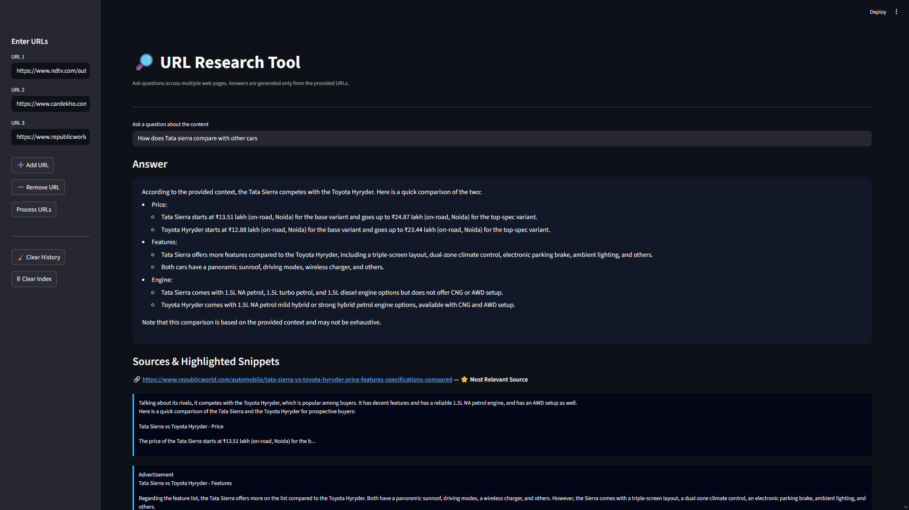
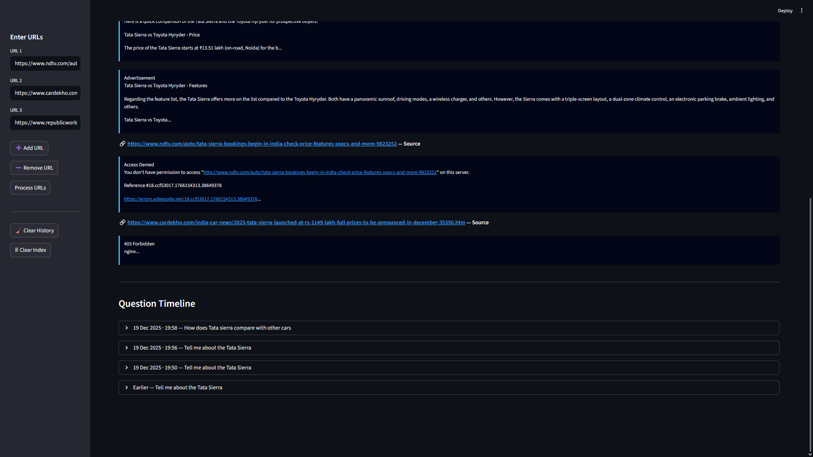

# URL Research Tool

A local, explainable URL-based research assistant built using Retrieval-Augmented Generation (RAG).
The system allows users to query multiple web pages and generates answers strictly from the provided sources.

---

## Features

- Query multiple URLs simultaneously
- Retrieval-Augmented Generation (RAG)
- Source attribution and ranking
- Highlighted evidence snippets
- Question timeline with history
- Fully local and free (no paid APIs)

---

## Screenshots

### Main Interface


### Answer with Sources and Timeline


---
## Tech Stack

- Python
- Streamlit
- LangChain (1.x)
- FAISS (Vector Database)
- Ollama (Local LLM & Embeddings)

---

## How It Works (High Level)

1. URLs are loaded and converted into documents
2. Documents are split into chunks
3. Embeddings are generated locally
4. FAISS indexes the embeddings
5. User queries are matched using vector similarity
6. The LLM generates answers only from retrieved chunks
7. Sources and snippets are shown for transparency

---

## How to Run

### 1. Install dependencies

```bash
pip install -r requirements.txt
```

### 2. Install and start Ollama

Download Ollama from: https://ollama.com

Pull the required model:

```bash
ollama pull llama3
```

Start the Ollama service:

```bash
ollama serve
```

### 3. Run the application

```bash
streamlit run app.py
```

---

## Usage

1. Enter one or more URLs in the sidebar
2. Click Process URLs to build the knowledge base
3. Ask questions related to the content
4. View:
   - Generated answer
   - Ranked source links
   - Highlighted evidence snippets
   - Timeline of previous questions

---

## Notes

- All embeddings and vector indexes are generated locally
- No external paid services or APIs are used
- The vectorstore is generated at runtime and not committed to GitHub
- Question history is stored per session

---

## Project Motivation

This project demonstrates an explainable alternative to generic chatbots by ensuring:

- Answers are grounded strictly in user-provided data
- Sources are transparent and verifiable
- The system works entirely offline after setup

---

## Repository

GitHub:
https://github.com/SrijanSharma08/URL_Research_Tool
